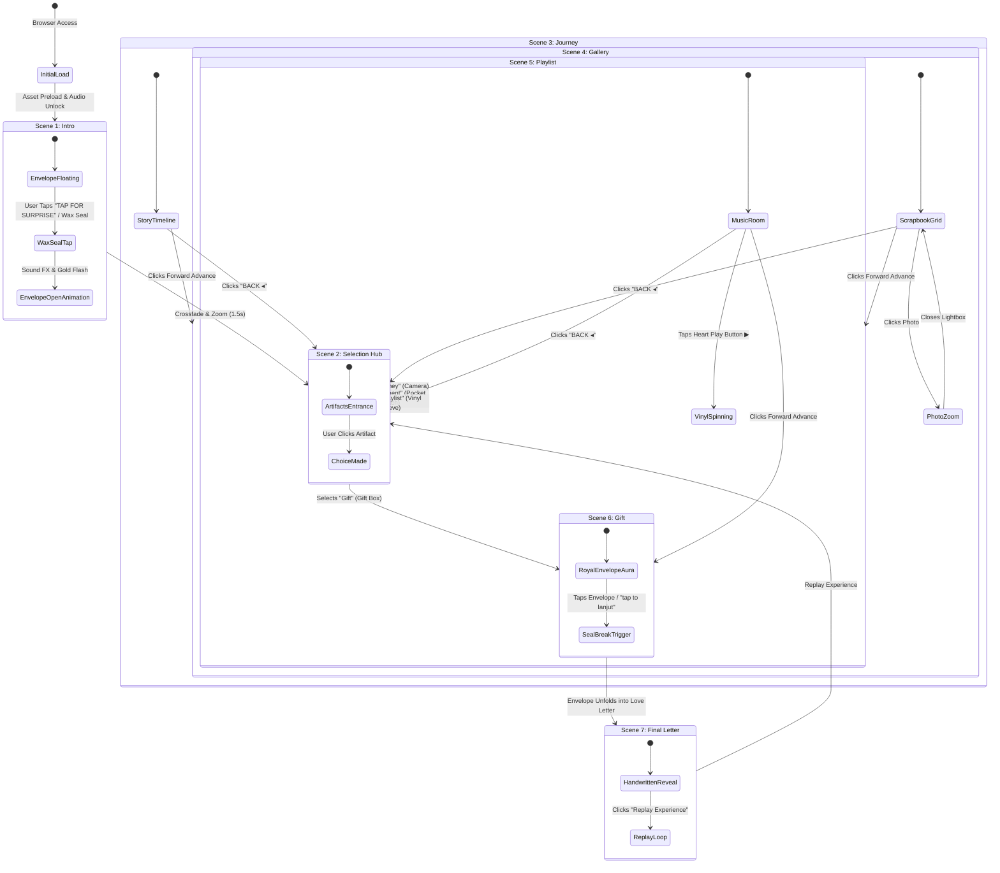

# Experience Flow Specification

> **Document Purpose:** Defines the complete user journey, narrative arc, scene progression state machine, interactive branchings, and transition choreographies.

---

## 1. Journey Architecture Diagram

---

## 2. Stage-by-Stage Narrative Walkthrough

### Phase 1: Entry & Intro Cinematic Sequence (`IntroScene`)
1. **Initial State (Silent Anticipation):**
   - User opens URL. The page displays the deep crimson vignette backdrop.
   - Ambient sound begins softly (gentle piano or acoustic chord) on the first user touch/click.
2. **Atmospheric Reveal:**
   - Background lighting illuminates the center spotlight.
   - The open envelope floats in with a gentle vertical oscillation (`floatingMovement`).
   - The 5 surrounding photograph cards cascade into position from slight elevations (`photoEntrance` with `-4°` to `+6°` tilt offsets).
   - Monarch butterfly flutters and perches on the bottom-left photograph.
3. **Headline Inscription:**
   - *"Happy Anniversary"*, date `26-09-26`, and dedication inscription fade in with dramatic letter-spacing settle (`dramaticReveal`).
4. **User Action:**
   - User taps the central wax seal or the bottom torn parchment banner **"TAP FOR SURPRISE"**.
5. **Transition Out:**
   - Wax seal glows bright amber; sound of breaking wax seal / paper rustle plays.
   - The envelope and photos scale slightly outward and cross-fade into the Selection Hub (`sceneTransition`, duration 1.5s).

---

### Phase 2: Thematic Selection Hub (`SelectionScene`)
1. **Entrance:**
   - Dramatic headline *"Choose the Surprise"* appears at the top.
   - 4 skeuomorphic artifacts emerge upward in a staggered wave from left to right (stagger interval `0.12s`):
     1. **Journey:** Vintage mechanical camera on aged correspondence.
     2. **Moment:** Antique pocket watch with `26-09-26` commemorative date tag.
     3. **Playlist:** Vintage paper vinyl record sleeve sliding out disc.
     4. **Gift:** Wrapped gift box with gold ribbon and red butterfly.
2. **Interactive State:**
   - Hovering over an artifact triggers tactile elevation (`y: -10px`, `scale: 1.05`), a warm golden halo shadow, and an animated script underline on its label.
3. **User Action:**
   - Clicking any artifact selects that specific memory path.
   - Alternatively, clicking the global **"TAP FOR SURPRISE"** button at the bottom advances the user through the linear narrative starting with *Journey*.
4. **Transition Out:**
   - The selected artifact scales forward as the remaining three fade away, transitioning seamlessly to the targeted scene.

---

### Phase 3: Exploratory Memory Chapters

#### Chapter A: Journey (`JourneyScene`)
- **Arrival:** Title *"Our Journey: Bruno Mars - 'Risk It All'"* reveals alongside the gilded baroque picture frame.
- **Visual Engagement:**
  - Ambient pink heart particles drift gently upward.
  - An open treasure box filled with rose petals and heart notes sits adjacent to a classic camera.
  - Cyan musical notes float out from the wind-up music box labeled *"Our Soundtrack"*.
- **Navigation Options:**
  - **Back Button:** Tapping the sage green **"BACK ◂"** button at the top-right smoothly returns the user to the Selection Hub.
  - **Next Chapter:** A forward arrow or swipe gesture advances to the Gallery.

#### Chapter B: Gallery / Moments (`GalleryScene`)
- **Arrival:** Warm string fairy lights canopy lights up across the top.
- **Scrapbook Assembly:**
  - 8 polaroid photo cards land with tactile drop-and-settle animations into a 2×4 scrapbook arrangement.
  - Scrapbook stickers (Saturn planet, blue whale, 3D wax heart pins, velvet ribbons) drop into place.
- **Interactive Actions:**
  - Tapping any photo brings it to the center foreground in a zoom-lightbox with an expanded handwritten caption.
  - Tapping outside dismisses the zoom.
- **Navigation:**
  - "BACK ◂" returns to Selection Hub; forward navigation advances to Playlist.

#### Chapter C: Playlist & Letter Altar (`PlaylistScene`)
- **Arrival:** Deep red velvet curtain backdrop fades in with burning candlelight on both flanks.
- **Visual Focal Points:**
  - The couple's names *"Nayyy & Keillaa"* shine in flowing gold cursive at the top.
  - On the left: The aged parchment letter framed in fresh red rose petals displays the personal anniversary message.
  - Center: Black grooved vinyl record with a red heart play button (`▶`).
  - Right: Gilded portrait frame resting upon a vintage camera.
- **Interactive Music Player:**
  - Tapping the heart play button starts the vinyl spinning (`rotation: 360`, continuous loop).
  - Background music track switches to the couple's dedicated anniversary song (via `AudioManager`).
  - Tapping again pauses the vinyl with a smooth deceleration curve.
- **Navigation:**
  - "BACK ◂" button returns to Selection Hub.

#### Chapter D: The Sealed Keepsake (`GiftScene`)
- **Arrival:** Ornate gold filigree corner scrollwork frames the screen.
- **Focal Experience:**
  - Headline *"Press the Envelope"* twinkles with starlight flares.
  - A closed royal cream envelope rests on a dense circular bed of dew-dropped rose petals and gold glitter.
  - Burgundy wax seal stamped with the couple's intertwined **"N&K"** monogram pulses with an atmospheric breathing glow.
- **User Action:**
  - User taps the envelope or the text *"tap to lanjut"*.
- **Climactic Transition:**
  - The wax seal snaps open with audio feedback.
  - The envelope flap unfolds in 3D perspective (`rotationX: -180deg`), and a long parchment letter glides forward to fill the screen, transitioning into the Final Letter Scene.

---

### Phase 4: Climax & Keepsake Finale (`FinalLetterScene`)
1. **Letter Presentation:**
   - Full-screen unfolded deckle-edge parchment card (`PaperCard`).
   - Sincere love letter text rendered in Dancing Script handwritten calligraphy.
   - Soft background bokeh and falling rose petals cascade slowly down the viewport.
2. **Audio Climax:**
   - Soundtrack swells into a warm, emotional crescendo.
3. **Closing Actions:**
   - **"Replay Journey"** button returns the user to the Selection Hub.
   - **"Mute/Unmute"** controls remain accessible throughout.

---

## 3. Global Navigation & Scene Director Rules

| Rule | Requirement |
|---|---|
| **Non-Destructive Navigation** | The user can visit any chapter from the Selection Hub without losing overall progress or restarting the background music. |
| **History / URL Sync** | Each scene reflects in the URL hash (`#intro`, `#selection`, `#journey`, `#gallery`, `#playlist`, `#gift`, `#letter`) to support browser back/forward buttons. |
| **Persistent Audio Track** | Background music does not abruptly stop on scene transitions; it smoothly crossfades or adjusts volume via `AudioManager.fadeOut` / `fadeIn`. |
| **Mobile Swipe Gestures** | Horizontal swipes can advance or retreat between linear chapters on touch devices. |
| **Esc / Dismiss** | Pressing `Escape` on desktop closes any open photo lightbox or modal. |
